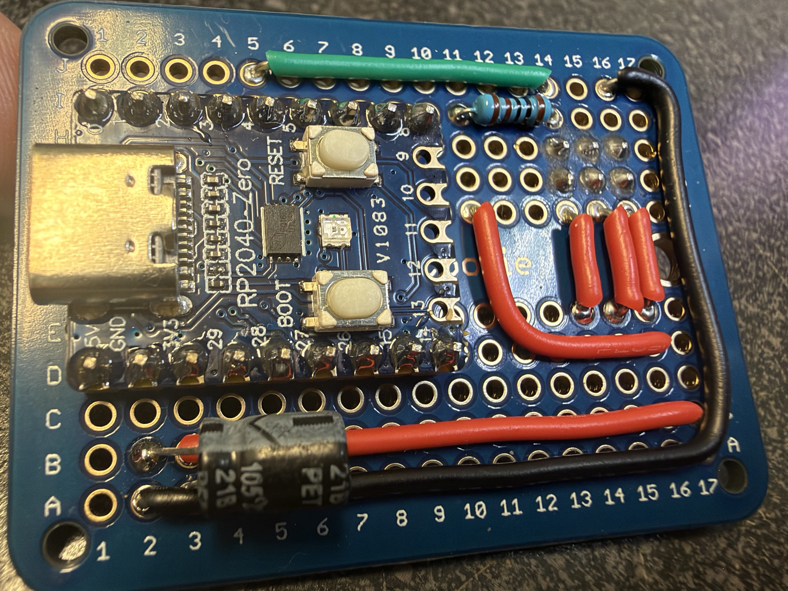

# Pico RISC-V Debugger
Turn your RP2040 into ch32v003 flasher/debugger. Forked from
[Apache02/pico-rvd](https://github.com/Apache02/pico-rvd), which is in turn a
fork of [aappleby/picorvd](https://github.com/aappleby/picorvd) (see
[links](#links) below).

## Requirements

* [pico-sdk](https://github.com/raspberrypi/pico-sdk)
* `PICO_SDK_PATH` environment variable
* The two git submodules. cmake fetches each one on first use if its
  directory is empty; to fetch them up front instead, run
```shell
git submodule update --init
```
  (not `--recursive`: the kernel's own submodules hold ports the RP2040 build
  does not use). They are:
  * `FreeRTOS-Kernel/`: the FreeRTOS SMP kernel, pinned to the commit the
    firmware is tested against. Set `FREERTOS_KERNEL_PATH` to build against a
    kernel elsewhere.
  * `SAOv3-lib/`: [SAOv3-lib](https://github.com/RareCircuits/SAOv3-lib), for
    the SAOv3 host commands. Pass `-DSAOH_CORE_DIR=<SAOv3-lib>/host/saoh_core`
    to cmake to build against a checkout elsewhere.


## Getting started

0. Connect pin PD1 on your CH32V device to the Pico's SWIO pin (defaults to pin GP4), connect CH32V ground to Pico ground, and add a 1Kohm pull-up resistor from SWIO to +3.3v.




1. Build debugger.
```shell
mkdir build
(cd build && cmake .. && make pico_rvd)
```


2. Flash it to pico.

Copy `build/pico_rvd.uf2` to RPI-RP2

or run command
```shell
(cd build && make pico_rvd---deploy)
```

_Steps 1 and 2 required only once._


3. Build ch32v003 blink example and flash it.
```shell
(cd examples/blink && make)
```

## Console
Pico detects as two ttyACMx devices. First one is debugger console. Connect via
```shell
minicom -D /dev/ttyACM0
```
or
```shell
tio /dev/ttyACM0
```
and type "help" to get list of commands.

## Factory programming

`factory` (in the console) starts an autonomous flashing loop for production:
plug a board in, it gets flashed with the factory image stored in the probe,
verified, and booted. Every outcome is recorded -- as a `CSV,...` console
line, and also in a persistent log in the probe's own flash (2048 records).

### Loading the factory image

The probe enumerates a small USB drive, `PICORVD`, next to its serial ports:

* `README.TXT` -- what is stored right now
* `CONFIG.TXT` -- the image's settings, editable in place
* `CURRENT.BIN` -- the stored image (read-only)
* `LOG.CSV` -- the factory log as of this boot (read-only; capped at 64KB,
  roughly the first 700 records -- `factory log` on the console has them all)

Copy a target firmware `.bin` onto the drive (and/or edit and save
`CONFIG.TXT`). Once writes settle, the probe stores the image in its flash,
with CRCs, and restarts; the drive reappears showing the new image. Images
are limited to 16320 bytes: the target's last 64-byte flash page is never
erased, since CH32V003 firmware commonly keeps its settings there.
`factory image` on the console shows what is stored.

`CONFIG.TXT` settings:

* `note` -- the label written to the log for each board. Left unchanged, a
  new upload sets it to the file name and CRC.
* `uart_selftest`, `uart_baud` -- standalone programmer: a byte sent to the
  target over the SWIO pin as 8N1 UART once the new firmware has booted, e.g.
  to trigger a self-test mode. `none` to skip.
* `vid`, `pid`, `selftest` -- tethered probe: after booting, the target is
  found over I2C with an SAOv3 bus scan (SAOs differ in default address), its
  SAOv3 magic/protocol version checked, its VID:PID matched (`none` accepts
  any), and the vendor self-test command sent (`none` to skip). If it exposes
  the standard SAOv3 LED class, every LED is painted white for a visual check.

### Standalone programmer boards

`pico_rvd_factory.uf2` is the same firmware built for PC-less production: it
starts the factory loop at boot, so a programmer board wired to a target
connector can be powered by the (battery-fitted, unflashed) board it is
plugged into and flash it immediately. It assumes nothing about the target
beyond a CH32V003 to program: success is the verified flash read-back, shown
on the status LED, which is the whole operator interface --

* blue, pulsing: waiting for a board
* red, fast blink: flashing
* orange, pulsing: flashed and verified; booting it and sending the self-test byte
* green, pulsing: done, unplug it
* red, double blip: failed, set the board aside (it keeps retrying while plugged)
* magenta, pulsing: no factory image stored yet
* frozen, in any state: the probe is wedged/latched-up, power cycle it

Colors appear on boards whose status LED is a WS2812; a plain LED carries
the same information in the blink pattern alone. The programmer boards are
Waveshare RP2040-Zeros (WS2812 on GP16), selected at configure time --
board choice is per build directory:

```shell
cmake -B build-zero -G Ninja -DPICO_BOARD=waveshare_rp2040_zero
ninja -C build-zero pico_rvd_factory
```

No console or host is needed during production; the flash log is the
record. Load the image through the drive first, at a bench.

To collect the logs afterwards, plug each programmer into USB and either copy
`LOG.CSV` off the drive, or run

```shell
tools/collect_factory_logs.py /dev/cu.usbmodemXXXX1 --master factory_master.csv --clear
```

which appends that probe's records (keyed by probe serial + sequence, so
re-collection never duplicates) to one master CSV, stamps them with the
collection time (the probes have no clock), and with `--clear` erases the
probe's log. The console equivalents are `factory log` and `factory stop` +
`factory clear`.

## Links
* https://github.com/Apache02/pico-rvd
* https://github.com/aappleby/picorvd
* https://github.com/cnlohr/ch32v003fun
